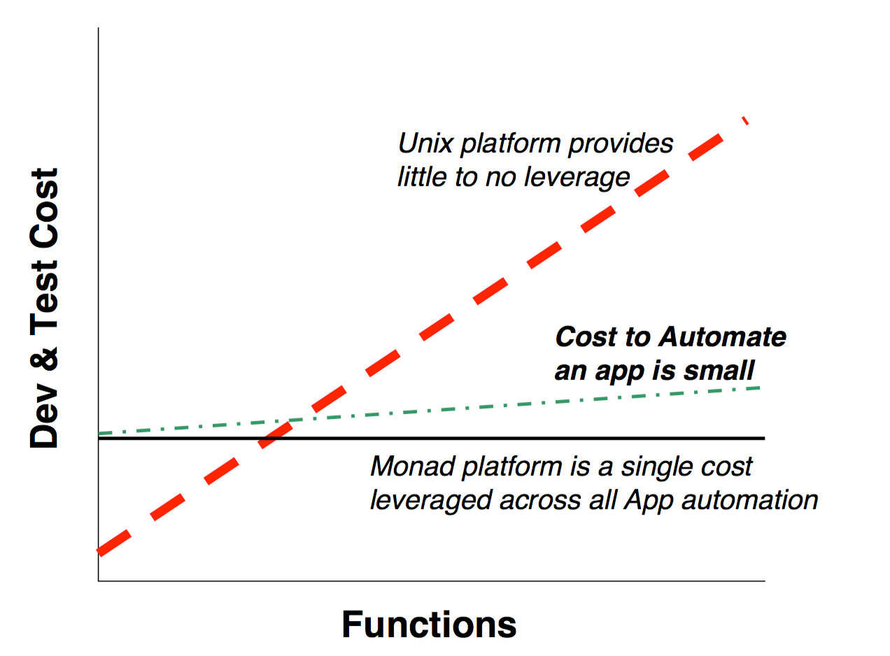

#Capítulo 5 - El modelo de automatización de Monad (MAM)
___
Monad define un modelo de automatización altamente apalancado para aplicaciones. El modelo extrae funciones comunes para que puedan implementarse una vez en el entorno de ejecución. Esto proporciona tanto apalancamiento para el desarrollador como coherencia para los administradores. El costo incremental para desarrollar y probar funciones específicas de la aplicación es bastante bajo en comparación con los métodos tradicionales.

Los desarrolladores exponen un modelo de automatización a los administradores como un conjunto de nombres y verbos fáciles de utilizar. El desarrollador las implementa subclasificando un conjunto de clases de automatización base de .NET, marcándolas con atributos de automatización para producir un conjunto de Cmdlets. El motor MSH expone estos cmdlets como un API y un conjunto de comandos. Los administradores y los desarrolladores de herramientas ahora obtienen una forma general de acceder uniformemente a la automatización de todos los aspectos del sistema operativo.

## 5.1 - Un ejemplo

Imagine al desarrollador que necesita exponer el registro de sucesos de Windows para la automatización de informes. El desarrollador decide cómo estructurar la automatización en términos de sustantivos y verbos ("Get-EventLog"). Monad proporciona una sólida orientación sobre este tema. El desarrollador escribe un CmdLet (en C #, VB.NET, COBOL, etc) para exponer esta función.

Un CmdLet podría verse así [^5-1]:

A primera vista puede parecer que el Admininistrador no va a obtener mucho uso de este código, pero nada podría estar más lejos de la realidad. El uso de los atributos CmdNoun y CmdVerb registra automáticamente este CmdLet como el comando **"Get-EventLog"** con un solo parámetro **"LogName"**. El Admininistrador entonces usa este comando junto con un conjunto de comandos de utilidad base para componer escenarios mucho más complejos

¿Qué está llenado el log de aplicación? [^5-2]

_¿Por qué MSI Installer está llenando el log?_

Al cambiar el último CmdLet en la canalización (pipeline), esta información se puede mostrar en XML, CSV, LIST, HTML, EXCEL o cualquier otro formato.

_¿El uso de mi registro de eventos es regular a lo largo de la semana?_

El administrador puede agregar Cmdlets adicionales a la canalización (pipeline) para filtrar sólo aquellos eventos que se generaron el martes y luego averiguar qué eventos ocurren más allá de ese día `($ Get-EventLog application |Where {$\_.TimeWritten.DayofWeek -eq "Tuesday"} |Group EventID)`. Después de haber encontrado el evento más frecuente de los martes, pueden filtrar fácilmente el registro para ese evento y determinar la distribución de dicho evento a través de los días de la semana. `($ Get-EventLog application |Where {$\_.EventID -eq 131080} |Group {$\_.TimeWritten.DayofWeek})`

Monad requiere una pequeña cantidad de código CmdLet [^5-3] para integrarse en el entorno de ejecución y aprovechar su rico conjunto de funciones y utilidades para proporcionar un potente y distinguido conjunto de funciones administrativas. Si bien este ejemplo se centró en una investigación ad hoc, es obvio cómo esta investigación podría conducir a un conjunto de informes nocturnos automatizados. Este ejemplo es un escenario sencillo. Los cmdlets completos necesitarían proporcionar una gama completa de verbos, hacer que las entradas se validen y realizar el manejo de errores. Sin embargo, los ahorros en desarrollo y prueba son dramáticos.

## 5.2 – Aprovechando .NET

Los desarrolladores utilizan los atributos .NET para descargar el trabajo al entorno de ejecución [^5-4]. La filosofía general de Monad es implementar las cosas una vez y luego usarlas en todas partes. Un rico conjunto de atributos declarativos dirigen el tiempo de ejecución de Monad para realizar acciones en nombre del desarrollador. Esto transfiere la responsabilidad de escribir y probar este código, así como de interactuar con el usuario durante las condiciones de error y producir y localizar mensajes de error.

Monad define los atributos de automatización en las siguientes áreas:

| | |
| --- | --- |
| Parsing Guidance | These tell the parser how to map user input to the CmdLet Request Object.  E.g. how to map parameters to properties, or whether a qualifier is mandatory. |
| Data Generation | These tell the new shell to process the user input to generate the actual data.  E.g. filename globbing. There will also be globbers for hostnames, ipaddrs, registrykeynames, ProcessNames, etc. |
| Data Validation | These express validation rules on the input data.  E.g. cardinality of the data, the min/max values of the data, etc. |
| Encoding Directives | These convey how to encode the processed user input into data objects.  E.g. a CmdLet may want an array of StreamWriters instead of an array of filenames. |
| Object Processing | Perform a set of common functions on common datatypes.  E.g. perform a ToLower() on strings. |
| Visibility/Applicability | These provide predicates for visiblity/applicablity.  E.g. Cmdlets can be tagged with the Machine and User Roles.  If a machine does not have the DHCP Server Role, the DHCP server commands will not be visible by default. |
| Documentation | These provide utilities information about the element.  E.g. Help |
| Test | These provide hints to utilities to facilitate the auto generation of Test Vectors. |

---

_**Notes**_

[^5-1]: Briefly, during development, PowerShell's "script cmdlets" (now, "advanced functions") did have a syntax similar to this. In C#, cmdlet source code still looks a lot like this.

[^5-2]: ORIGINAL: "Get-EventLog application" is provided by the sample code above and the rest come from the Monad base commands.  "Group source" counts the number of objects that have the same value for a particular property (i.e. how many times did a particular source show up?).  "Select -First 5" truncates the set of objects to only have the first 5.  "Format-Table" formats the objects and their properties a table

[^5-3]: Note that even in this document, Snover wasn't consistent about "CmdLet" versus "Cmdlet." Today, "cmdlet" is the standard. His original idea was to emphasize that a "cmdlet" wasn't a "full command" with all the parsing and whatnot a traditional command implemented; instead, it was a portion of a command, with much of the overhead being provided by the automation engine's base classes.

[^5-4]: Meaning, a .NET developer can tell the .NET runtime to perform certain standardized tasks. You see this a lot in PowerShell: for example, a function can declare a parameter as mandatory, and the shell will enforce that attribtue rather than the function developer having to write logic to do so. 
